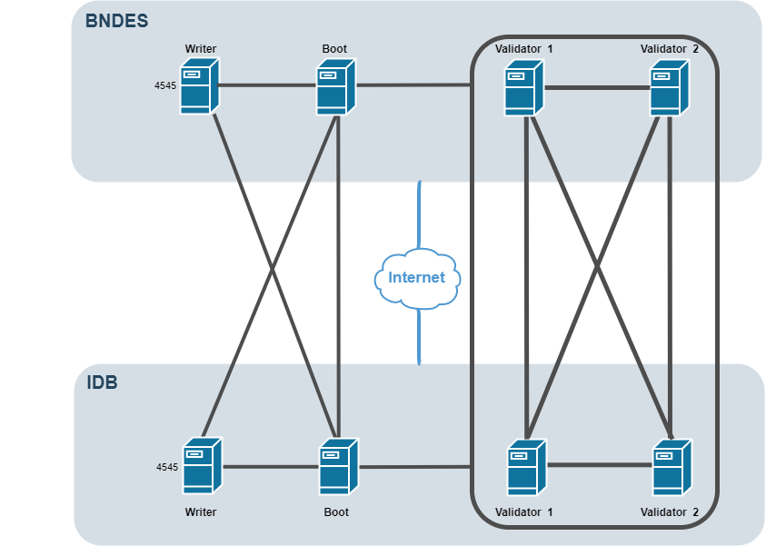

A RBB é uma rede público-permissionada. Há quatro tipos de nós: Boot, Validator, Writer e Observer. 
Os três primeiros tipos são nós que requerem permissão prévia, enquanto que o Observer é para o público em geral. 

A topologia da rede será análoga a da Lacchain: https://github.com/lacchain/besu-network/blob/master/TOPOLOGY_AND_ARCHITECTURE.md

# Passo 1 - Ambiente Físico
O procedimento da Lacchain contém configuração mínima de hardware: https://github.com/lacchain/besu-network/blob/master/DEPLOY_NODE.md

A recomendação do BID é uma VM por nó, sem docker, e que seja um SO Ubuntu 18.4 ou CentOS7. 

O BNDES instalou com RedHat 7, por similaridade com CentOS7. Embora não fosse uma plataforma oficialmente "homologada" pela Lacchain, nenhum problema foi encontrado.

# Passo 2 - Criação de Nós
BNDES possui 2 VMs Validator, 1 VM Boot e 1 VM Writer. Todas elas estão DMZ de blockchain com IPs públicos.
Os nós validadores precisam ter o mesmo IP outbound e inbound. 
Não há no momento nenhum nó Observer.

Para instalar os nós, seguir o procedimento da Lacchain: https://github.com/lacchain/besu-network/blob/master/DEPLOY_NODE.md
É possível configurar mais de um nó ao mesmo tempo utilizando o script do Ansible descrito pela Lacchain.
<<FALTA INCLUIR AS NOSSAS DIFERENÇAS>>

Utilizar na RBB:

- ChainID: 648629

Recomendação é instalar o Orion, mas não startar o serviço.

O processo de instalação de cada nó gerará a chave privada em Lacchain/data/privatekey. É necessário ter um mecanismo interno para gerir essa chave.
Importante: a chave pode ser regerada.

# Passo 3 - Filtros de Rede
Os nós do validadores devem ser conectáveis entre si, ao boot node e aos nós validadores e boot node do BID pelas portas 60606 TCP/UDP. 

- A porta 60606 do writer deve estar aberta para o boot node do BNDES e do BID.
- A porta 60606 do boot node deve estar aberta para aceitar conexão de qualquer IP.
- O writer node deve também ter aberta para a Internet a porta aberta 4545. Essa porta é equivalente a porta 8545 utilizada no Geth. Ou seja, é a porta que os dApps se comunicam com o nó writter para enviar transações e fazer consultas. 
- Não é necessário abrir a porta 4040, pois não temos a previsão de usar transações privadas (Orion) nesse momento.

# Passo 4 (opcional) - Ferramentas adicionais
Instalação de:
- transaction explorer (aleth.io), 
- monitoring tools (grafana e prometheus) - precisa mudar arquivo de configuração para indicar onde está prometheus
- dapp de permissionamento.

