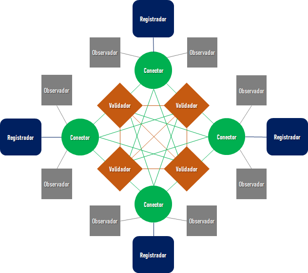

# Rede Blockchain Brasil

Bem vindo à Rede Blockchain Brasil!

A Rede Blockchain Brasil (RBB) é uma rede de instituições, de abrangência nacional, composta de estrutura de governança e infraestrutura tecnológica, que tem o objetivo de facilitar a adoção da tecnologia de blockchain para a implementação de aplicações de interesse público. A criação da rede permitirá a otimização de recursos, redução de custos e remoção de barreiras de entrada para uso da tecnologia e a inovação no setor público.

A RBB foi fundada pelo **Banco Nacional de Desenvolvimento Econômico e Social** (BNDES) e o **Tribunal de Contas da União** (TCU), através de um [Acordo de Cooperação](). Instituições que desejarem participar da rede deverão submeter sua solicitação à **Governança da RBB**.

## Organização

As instituições participantes da RBB podem ser classificadas como:

- Partícipes Aderentes **Parceiros**
  - Devem promover o uso da RBB em aplicações do serviço público e de interesse público e seguir as decisões sobre a RBB proferidas pela Governança da RBB;
  - Têm direito de executar nós que enviem transações para a rede e tenham acesso a toda a cadeia de blocos;
  - Têm direito a apresentar propostas e participar das reuniões de governança.

- Partícipes Aderentes **Associados**
  - Têm os mesmos direitos e deveres dos partícipes aderentes parceiros;
  - Têm o compromisso de executar nós que possam participar do consenso da rede;
  - Têm direito a votar nas propostas apresentadas.

- Partícipes **Patronos**
  - Apenas BNDES e TCU são considerados partícipes patronos;
  - Têm os mesmos direitos e deveres dos partícipes aderentes associados;
  - Têm direito a voto de desempate e vetar as propostas apresentadas.

A Governança da RBB é feita através de dois comitês:

- **Comitê de Governança**, que é responsável por:
  - Desenvolver e atualizar o [Regulamento da RBB]();
  - Decidir sobre aceitação de novos participantes;
  - Definir critérios para aceitação de casos de uso a serem suportados pela RBB;
  - Definir critérios para aceitação de usuários na RBB;
  - Analisar e definir esforços necessários para a melhor operação e evolução da RBB.

- **Comitê Técnico**, que é responsável por:
  - Acompanhar, revisar e avaliar o funcionamento da RBB;
  - Propor ao Comitê de Governança ajustes, alterações ou iniciativas de inovação nos processos ou nos componentes técnicos da RBB;
  - Apoiar o Comitê de Governança no acompanhamento de projetos e iniciativas em andamento;
  - Apoiar o Comitê de Governança com levantamento e análises de dados demandados para tomada de decisões.

## Projeto

A implantação da RBB será feita de forma gradativa, conforme determinado em seu [Plano de Trabalho](), que tem previstas as seguintes atividades:

- Implantação da rede laboratório 
- Elaboração do regulamento da RBB 
- Estruturação do piloto
- Operação assistida do piloto
- Estruturação da produção
- Promoção do uso da rede e evoluções

O Plano de Trabalho tem previsão de ser executado em 60 meses a partir da assinatura do [Acordo de Cooperação]() entre BNDES e TCU.

**TODO** Explicar melhor piloto e produção.

## Tecnologia

A RBB é uma rede público-permissionada. Isso significa que os nós que enviam transações e os nós que realizam a validação das transações são conhecidos e previamente autorizados, de acordo os requisitos e propósitos da RBB. Por outro lado, os nós que realizam apenas leitura das informações não precisam de tal autorização.

As redes público-permissionadas são uma solução adequada para aplicações de interesse público. É possível manter conformidade, aderência à legislação vigente, transparência para o público e independência de custos de taxas sobre transações, pagas em moedas virtuais altamente voláteis, que remuneram o processamento nas redes públicas.

A implementação de blockchain utilizada na RBB é a do projeto de código aberto [Hyperledger Besu](https://besu.hyperledger.org), que é baseada na rede [Ethereum](https://ethereum.org).

## Topologia

A RBB se baseou no *framework* da [LACChain](https://www.lacchain.net), para definir seu modelo de topologia, que é composta de:

- Nós Núcleo: Desempenham papel essencial para o correto funcionamento da rede. A rede não funciona sem eles.
  - **Nós Conectores** (*Boot Nodes*): Responsáveis por conectar nós validadores a nós satélites.
    - Compartilham o histórico e o estado dos blocos com novos nós.
    - Atualizam nós satélites sobre a geração de novos blocos gerados pelos nós validadores.
    - Repassam transações enviadas pelos nós registradores aos nós validadores.
    - Conectam-se com os nós validadores e nós registradores designados.
  - **Nós Validadores** (*Validator Nodes*): Validam as transações submetidas à rede.
    - Participam do protocolo de consenso e são responsáveis pela geração de novos blocos.
    - Conectam-se entre si e com os nós conectores.
- Nós Satélites: Não desempenham papel essencial no correto funcionamento da rede. Podem se conectar e desconectar da rede sem que isso prejudique o funcionamento da mesma.
- **Nós Registradores** (*Writer Nodes*): Podem submeter transações para a rede.
  - Enviam transações aos nós conectores, que por sua vez as repassam aos nós validadores.
  - Conectam-se com nós conectores designados.
- **Nós Observadores** (*Observer Nodes*): Só podem ler as informações registradas na rede.
  - Podem conectar-se apenas com nós conectores que estiverem abertos para permitir a leitura de blocos.
    - Observação: Atualmente a RBB ainda **não** suporta nós conectores com essa possibilidade.

